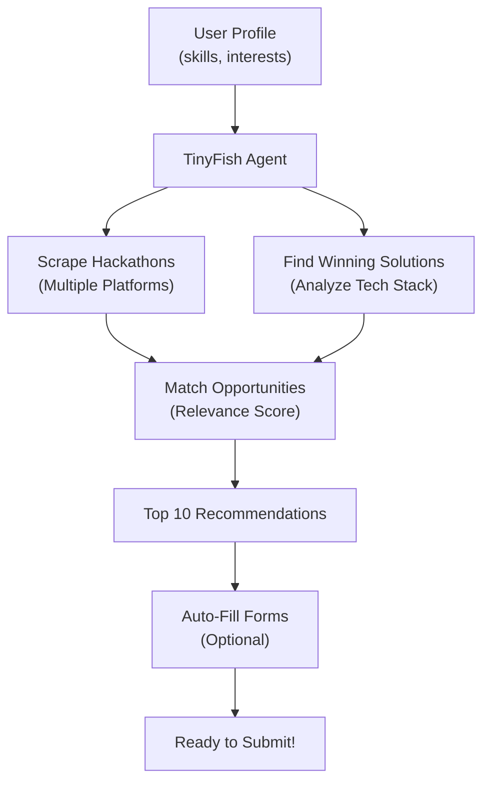

# ⚡ Quick Start Guide

## 5-Minute Setup

### Step 1: Install & Configure
```bash
cd /path/to/tinyFishHackathon
npm install
cp .env.example .env
```

Edit `.env`:
```env
TINYFISH_API_KEY=sk-tinyfish-oS4d3nXx-Eco83zakoFA1_1Ogdp4LJds
PORT=3000
```

### Step 2: Start Server
```bash
npm run server
```

Expected output:
```
╔════════════════════════════════════════════════════════════╗
║   HACKATHON AI AGENT - API Server                          ║
║                                                            ║
║   📍 Server: http://localhost:3000                         ║
║   📚 API Docs: http://localhost:3000/api                   ║
...
```

### Step 3: Test the API

**Health Check:**
```bash
curl http://localhost:3000/health
```

**Discover Hackathons:**
```bash
curl -X POST http://localhost:3000/api/discover \
  -H "Content-Type: application/json" \
  -d '{
    "skills": ["React", "Python"],
    "interests": ["AI", "Web"],
    "availability_days": 30
  }'
```

**Get Upcoming Hackathons:**
```bash
curl http://localhost:3000/api/hackathons/upcoming?days=30
```

---

## 🎯 Common Tasks

### Find Winning Solutions
```bash
curl http://localhost:3000/api/solutions/AI
```

### Auto-Fill a Submission Form
```bash
curl -X POST http://localhost:3000/api/forms/fill \
  -H "Content-Type: application/json" \
  -d '{
    "hackathon_url": "https://hackerearth.com/challenge/...",
    "project_name": "My AI Project",
    "project_description": "Builds on machine learning...",
    "team_members": [{"name": "Alice", "email": "alice@example.com"}],
    "technologies": ["Python", "React"],
    "github_url": "https://github.com/user/project"
  }'
```

### Run CLI Discovery
```bash
npm run agent
```

---

## 🔍 How It Works



---

## 📊 TinyFish Endpoints Used

| Endpoint | Purpose | Best For |
|----------|---------|----------|
| `/run-sse` | Streaming | Multi-step workflows, real-time progress |
| `/run` | Sync | Quick operations (< 30s) |
| `/run-async` | Background | Long tasks, monitoring |

---

## 🧠 Agent Architecture

```
HackathonOrchestratorAgent (Main Coordinator)
├── scrapeAllHackathons() -----> Multiple Platform Agents
├── findWinningSolutions() ----> Solution Analyzer
├── prepareSubmission()--------> Form Automation Agent
└── startBackgroundMonitoring() -> Opportunity Monitor
```

Each agent uses **TinyFish Web Agent** APIs to:
1. Navigate websites using natural language
2. Extract structured data as JSON
3. Fill forms and interact with pages
4. Handle JavaScript-rendered content

---

## 💾 Data Storage

- **Location**: `~/.hackathon-agent/data.json`
- **Format**: JSON for easy inspection & migration
- **Persistence**: Automatic on every change

View stored data:
```bash
cat ~/.hackathon-agent/data.json | jq
```

---

## 🚀 What You Can Do Now

✅ **Discover** hackathons matching your skills  
✅ **Analyze** winning solutions & tech patterns  
✅ **Auto-fill** submission forms  
✅ **Monitor** new opportunities in real-time  
✅ **Get detailed recommendations** with rankings  

---

## 📝 Next Steps

1. **Create user profile**:
   ```bash
   curl -X POST http://localhost:3000/api/users \
     -H "Content-Type: application/json" \
     -d '{
       "id": "user-1",
       "name": "Your Name",
       "skills": ["React", "Python"],
       "interests": ["AI", "FinTech"]
     }'
   ```

2. **Run discovery**:
   ```bash
   npm run agent
   ```

3. **Review recommendations** and submit!

---

## ❓ FAQ

**Q: Is my data saved?**  
A: Yes, in `~/.hackathon-agent/data.json`. Completely local, nothing sent to our servers.

**Q: Can I customize the recommendations?**  
A: Yes! Edit `src/agents/orchestrator.ts` to change scoring logic.

**Q: Does it submit forms automatically?**  
A: No, it fills them for review. You click submit.

**Q: Can I run multiple agents in parallel?**  
A: Yes, check `src/agents/orchestrator.ts` for concurrency limits.

---

## 🆘 Still Stuck?

Check logs:
```bash
LOG_LEVEL=debug npm run server
```

Check README.md for detailed documentation.

Good luck! 🎉
